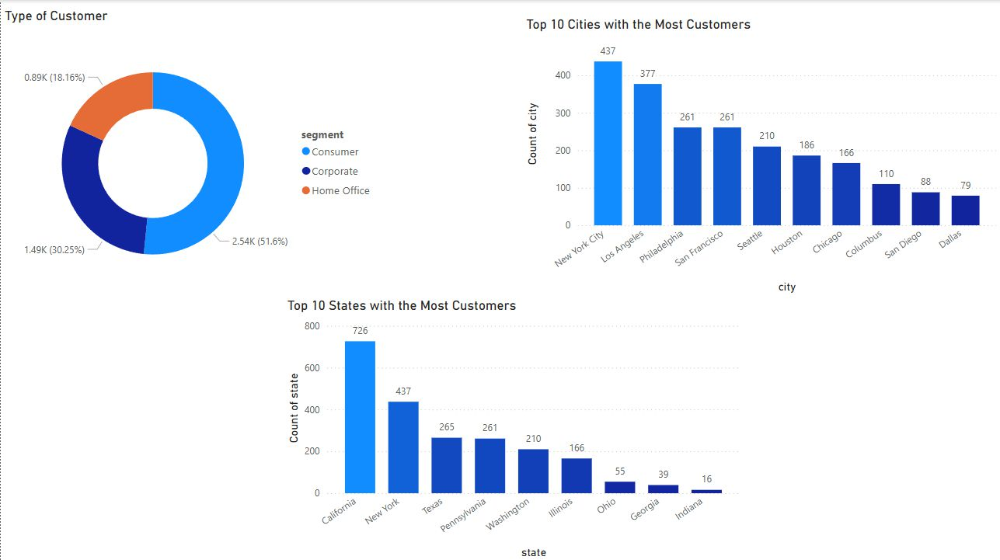
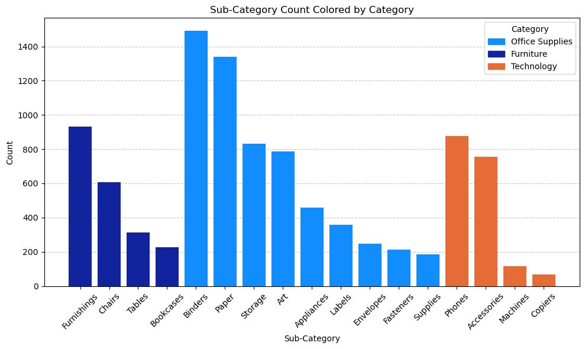
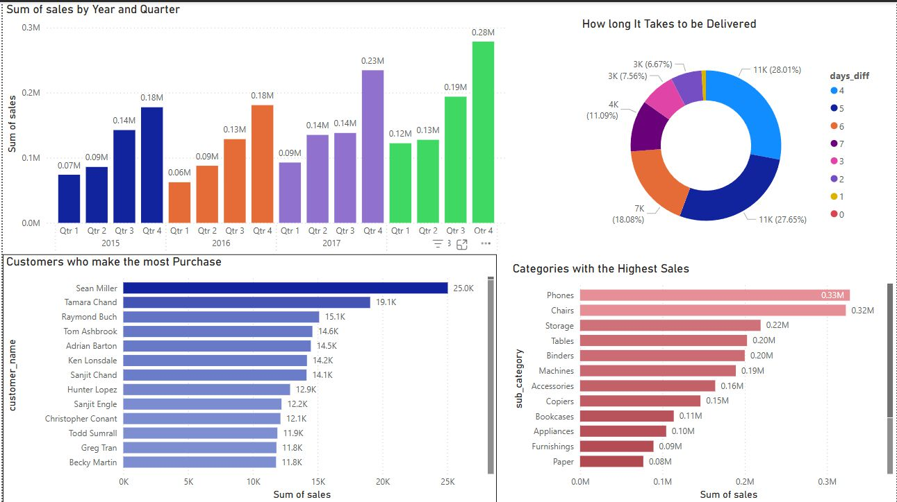
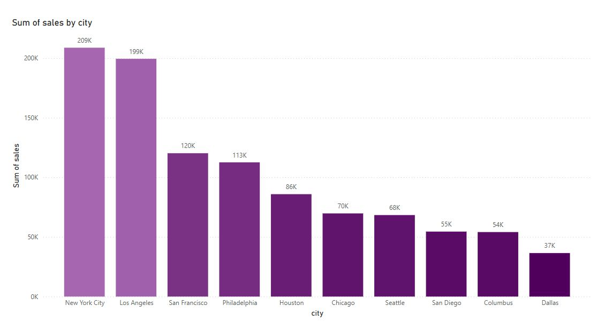

# Superstore Data Warehouse & BI Dashboards

An end-to-end BI solution built on a star-schema warehouse with ETL pipelines and interactive dashboards for the Superstore dataset

## Dashboard Preview

  <table>
    <tr>
      <td>
         
        <b>Overview</b>
      </td>
      <td>
         
        <b>Product Performance</b>
      </td>
    </tr>
    <tr>
      <td>
         
        <b>Sales Trends</b>
      </td>
      <td>
         
        <b>Sales by City</b>
      </td>
    </tr>
  </table>
  

## Highlights

* **Data Warehouse**: Star schema centered on `fact_sale` with well-defined dimensions.
* **ETL Workflows**: Pentaho jobs for dimension and fact processing.
* **Dashboards**: Visual narratives for Customer, Product, Sales, and Shipping.

## Tech Stack

* **Database**: PostgreSQL (Data Warehousing)
* **ETL Tool**: Pentaho Data Integration (PDI)
* **Visualization**: Power BI

## Data Model

The project utilizes a **Star Schema** design to optimize analytical queries, consisting of a central fact table and multiple dimension tables.

### Schema Components

* **Fact Table (`fact_sale`)**: Quantitative measures (sales, order/ship dates) and derived `days_diff` for delivery time.
* **Dimension Tables**:

  * **`dim_product`**: Category, sub-category, and product details.
  * **`dim_customer`**: Customer demographics and segments (Consumer, Corporate, Home Office), plus geography.
  * **`dim_ship`**: Shipping modes (e.g., Second Class, Standard Class) and related attributes.

## ETL Workflows

Pentaho transformations orchestrate consistent, repeatable processing.

1. **Dimension Processing**: Rename/clean columns, encode labels, remove duplicates, normalize data types for Customer, Product, and Shipping.
2. **Fact Processing**: Map surrogate keys from dimensions to the sales fact table and compute `days_diff` for delivery metrics.

Open the workflows:

* Dimension load: [load_dim_customer.ktr](load_dim_customer.ktr)
* Fact load: [load_fact_sales.ktr](load_fact_sales.ktr)

## Our Team

This project was presented our team at the **Institute of Technology of Cambodia**, Department of Applied Mathematics and Statistics.

* **Lecturer**: Mr. Ngin Kimlong
* **Team Members**: Pheth Soriyuon, Phoeun Rajame, Phoeurn Kimhor, Pich Daraphal

